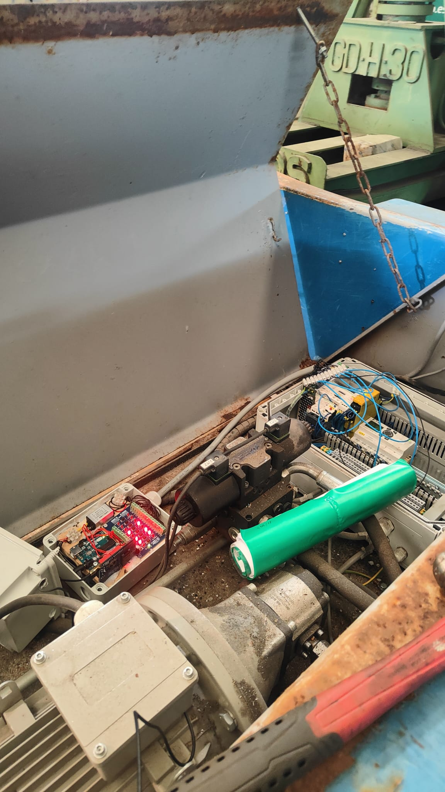
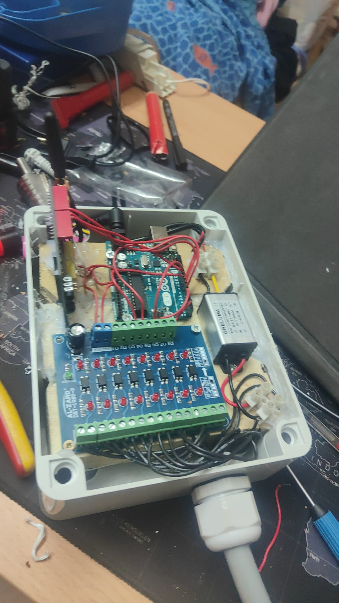

# IoT Automation Platform

## Overview

This IoT Sensor Monitoring Platform is a personal project in development, born from a real business need to monitor industrial machinery status. Built with Arduino/ESP32 modules for data collection, the platform receives, processes, and displays sensor data through an intuitive web interface. While currently an MVP, the project aims to demonstrate robust architecture principles and scalable design patterns.

## Project Objectives

- Receive real-time data from Arduino/ESP32 devices connected to industrial machinery
- Store sensor data efficiently for historical analysis and trend detection
- Display current machine states and historical data through a responsive web interface
- Provide configurable alerts for critical state changes
- Build a scalable and secure foundation for future expansion

## Hardware Integration

Our solution includes custom-built sensor modules using Arduino and ESP32:




The modules are designed to:
- Connect directly to industrial machinery
- Collect various sensor data (temperature, pressure, status, etc.)
- Transmit data securely to our platform

## Current Features

- **Data Ingestion**: Secure API endpoint for Arduino/ESP32 sensor data
- **Data Storage**: PostgreSQL with TimescaleDB for efficient time-series data handling
- **React Web Interface**: Real-time dashboard for monitoring machine states
- **Live Updates**: WebSocket integration for immediate data reflection
- **Historical Analysis**: Time-series data visualization and basic trending

## Tech Stack

### Backend
- **Framework**: Python/Flask
- **ORM**: SQLAlchemy
- **Database**: PostgreSQL with TimescaleDB
- **Real-time**: Flask-SocketIO

### Frontend
- **Framework**: React
- **State Management**: Context API
- **Data Visualization**: Recharts
- **Styling**: Tailwind CSS

## Project Structure
```
IoT-Automation/
├── flask_app/                  # Backend Flask application
│   ├── api/
│   │   ├── arduino.py          # IoT device data ingestion endpoints
│   │   └── dashboard.py        # Dashboard data endpoints
│   ├── models.py               # SQLAlchemy models
│   ├── db_utils.py             # Database utility functions
│   └── socket_events.py        # WebSocket event handlers
├── react_frontend/             # Frontend React application
│   └── src/
│       ├── components/
│       ├── scenes/
│       └── App.jsx
└── docs/
    └── images/                 # Project documentation images
```

## Project Status

This MVP is in active development. Current focus areas include:
- Enhancing data visualization capabilities
- Implementing robust error handling for device communication
- Developing a comprehensive alert system
- Expanding frontend functionality (JWT authentication, advanced visualizations)
- Improving system architecture using Domain-Driven Design principles

## Future Enhancements

- Advanced anomaly detection
- Machine learning for predictive maintenance
- Mobile application for alerts
- Enhanced security features
- Multi-tenant support

## Contributing

The project is currently in MVP phase. For contribution inquiries, please contact the repository owner.

## License

This project is licensed under the MIT License.